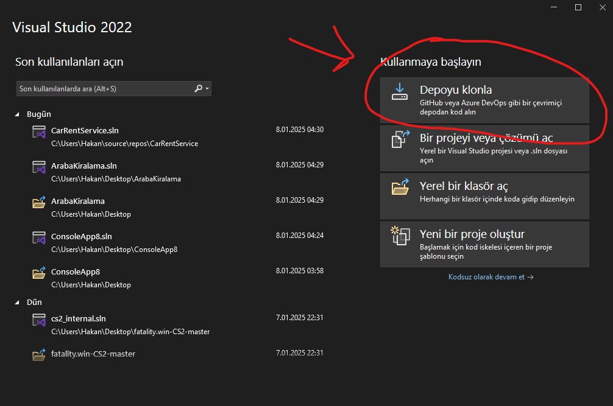
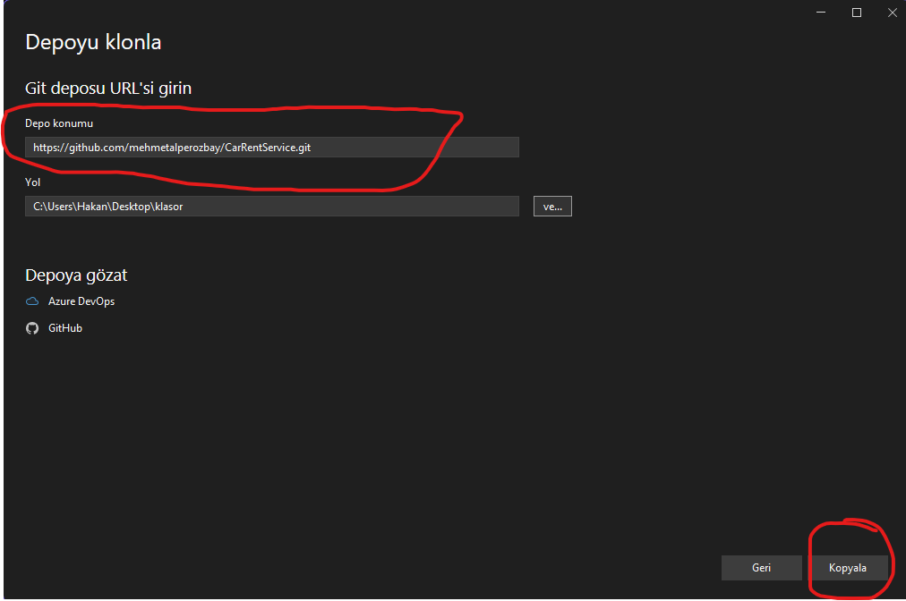

# CarRentService

CarRentService, araç kiralama süreçlerini yönetmek ve kullanıcı doğrulamalarını gerçekleştirmek için geliştirilmiş bir uygulamadır. Proje, kullanıcıların araç kiralama işlemlerini basitleştirirken yöneticiler için de bir admin paneli sunmaktadır.[Hızlı İndir](https://github.com/mehmetalperozbay/CarRentService/releases/download/v1.0.0/ArabaKiralama.zip) 

Bu Proje Ödev Olarak Yapılmıştır. 2024 - 2025 Eğitim Öğretim Yılı. 

## Özellikler

- **Admin Paneli:**
  - Kullanıcıları Spectre Console ile Görme.
  - Kiralanan Arabaları Görme.
  - Kullanıcı Ekleme.
  - Kullanıcı Silme.
  - Kullanıcı Sorgulama (MySql).
  - Destek Talepleri.
  - Kiralama geçmişi görüntüleme.
- **Kullanıcı Paneli:**
  - T.C. Kimlik No (TCKN) doğrulama sistemi.
  - Araba Modellerini Görme.
  - Araba Kiralama.
  - Destek Talebi Açma.
  - Kullanıcı Kayıt.
  - Kullanıcı Girişi.
  - Araç Kiralama Sözleşmesi.
- **API Entegrasyonu:**
  - TCKN doğrulama işlemleri için dış bir API kullanımı [NVI API](https://www.nvi.gov.tr/).

## Kullanılan Teknolojiler

### Backend
- **C# (ASP.NET Core)**: Backend geliştirme için.
- **HttpClient**: TCKN API'sine istek gönderme ve yanıt alma işlemleri.
- **MySQL**: Veritabanı yönetimi.
- **Spectre.Console**: Veritabanından gelen verileri güzel göstermek.

  
### Kullanılan NuGet Paketleri
- **[MySql.Data (v9.1.0)](https://www.nuget.org/packages/MySql.Data/):** MySQL veritabanı ile bağlantı.
- **[Newtonsoft.Json (v13.0.3)](https://www.nuget.org/packages/Newtonsoft.Json/):** JSON verilerini işlemek için.
- **[Spectre.Console (v0.49.1)](https://www.nuget.org/packages/Spectre.Console/):** Konsol tabanlı zengin kullanıcı arayüzü oluşturmak için.

### API
- **TCKN Doğrulama API'si:** Kullanıcıların T.C. Kimlik Numaralarını doğrulamak için bir dış API kullanıldı [NVI API](https://www.nvi.gov.tr/).

## Gereksinimler

Projeyi çalıştırmak için aşağıdaki yazılımlara ihtiyacınız var:

- [.NET SDK (5.0 veya üzeri)](https://dotnet.microsoft.com/download)
- [MySQL Server](https://www.mysql.com/)

### Projeyi Klonlama
Adım 1:  'Depoyu Klonla' Butonuna Basın.




Adım 2: Depo Konumunu **```https://github.com/mehmetalperozbay/CarRentService.git```** Olarak Değiştirin ve 'Kopyala' Butonuna Basın.



Veya

```bash
git clone https://github.com/mehmetalperozbay/CarRentService.git
cd CarRentService
